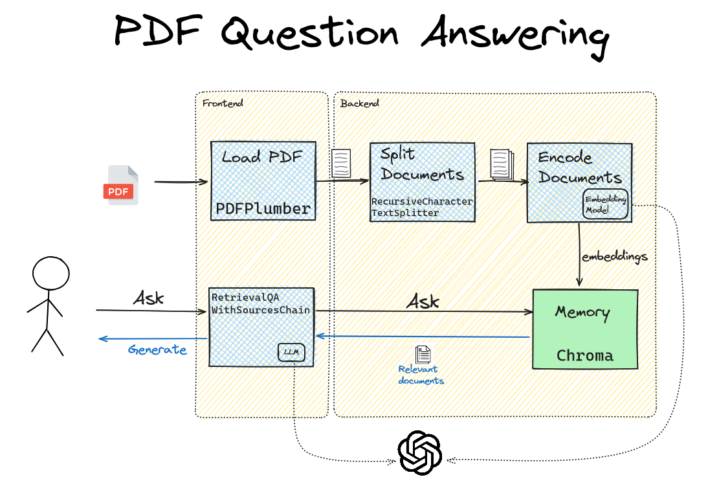

---

# PDF Question Answering (QA) Application

Welcome to the PDF QA Application! This project allows you to upload a PDF or text file and ask questions about the content of the file. The application uses advanced natural language processing and document search capabilities to provide accurate answers.

## Getting Started

### Prerequisites

Before running the application, ensure you have the following prerequisites installed:

- Python 3.x
- Chroma Database (Installation instructions can be found [here](https://docs.trychroma.com/installation))

### Installation

1. Clone the repository to your local machine:

   ```shell
   git clone https://github.com/Ayyodeji/Langchain-LLM-PDF-QA.git
   ```

2. Navigate to the project directory:

   ```shell
   cd Langchain-LLM-PDF-QA
   ```

3. Install the required Python dependencies:

   ```shell
   poetry install
   ```

   If you don't have Poetry installed, you can install it using:

   ```shell
   pip install poetry
   ```

4. Start a Poetry shell:

   ```shell
   poetry shell
   ```

   Please create an `.env` file from `.env.sample` once the application is installed. Edit the `.env` file with your OpenAI organization and OpenAI key:

   ```shell
   cp .env.sample .env
   ```

## Usage

### Uploading a File

1. Start the application:

   ```shell
   chainlit run app/app.py -w
   ```

2. Access the application in your web browser (by default, it runs on http://localhost:5000).

3. You'll be greeted with a welcome message and instructions on how to use the application.

4. Click the "Upload" button to select and upload a PDF or text file.

### Asking Questions

1. After uploading a file, you can ask questions related to the content of the file.

2. The application will use advanced natural language processing to provide answers based on the uploaded document.

## Configuration

You can configure the application by modifying the settings in the `.env` file. This includes setting the OpenAI API key, adjusting search engine parameters, and more. Please refer to the documentation for detailed configuration options.

## Advanced Usage

This application can be extended and customized for various use cases. You can explore advanced features such as customizing prompts, integrating with different document loaders, and optimizing the search engine. Detailed instructions and examples can be found in the documentation.

## Contributing

We welcome contributions to this project. If you have ideas for improvements, bug fixes, or new features, please open an issue or submit a pull request. Your contributions help make this application better for everyone.

## License

This project is licensed under the [MIT License](LICENSE). You are free to use, modify, and distribute the code for your own purposes.

## Workshop Details

This project was developed as part of a workshop series. Below are details about the workshops:

- [Lab 1: Basic chat with data LLM App](#lab-1-basic-chat-with-data-llm-app)
  - [Problem](#lab-1-problem)
  - [Solution](#lab-1-solution)
- [Lab 2: Basic prompt engineering](#lab-2-basic-prompt-engineering)
  - [Problem](#lab-2-problem)
  - [Solution](#lab-2-solution)

### Lab 1: Basic chat with data LLM App

The first lab in the workshop series focuses on building a basic chat application with data using LLM (Language Model) techniques. This application allows users to interact with a chat interface, upload PDF files, and ask questions related to the content of the files.

#### Lab 1 Problem

1. User uploads a PDF file.
2. App loads and decodes the PDF into plain text.
3. App chunks the text into smaller documents to fit the input size limitations of embedding models.
4. App stores the embeddings into memory.
5. User asks a question.
6. App retrieves relevant documents from memory and generates an answer based on the retrieved text.

#### Lab 1 Solution

In this lab, we used the following components to build the PDF QA Application:

- [Langchain](https://python.langchain.com/docs/get_started/introduction): A framework for developing LLM applications.
- [Chainlit](https://docs.chainlit.io/overview): A full-stack interface for building LLM applications.
- [Chroma](https://www.trychroma.com/): A database for managing LLM embeddings.
- [OpenAI](https://openai.com/): For advanced natural language processing.

The application's architecture is designed as follows:



To run the complete application, follow the instructions provided in the README.

### Lab 2: Basic prompt engineering

The second lab in the workshop series focuses on improving the question answering capabilities of the application by addressing issues related to prompt engineering. In particular, we address the problem of "hallucination" where the model generates incorrect information in responses.

#### Lab 2 Problem

During testing, we encountered issues with "hallucination," where the model generated incorrect information in responses. For example, when asking complex questions, the model sometimes produced factually incorrect answers. We needed to resolve this hallucination problem through prompt engineering.

#### Lab 2 Solution

To resolve the hallucination problem, we conducted experiments with different prompts and prompt structures. We discovered that removing certain prompts and modifying the sources prompt improved the model's accuracy in generating answers.

To implement these changes, we traced the Langchain source code to identify where prompts were used in the application. We then extracted and customized the prompts in a separate file and initialized the `RetrievalQAWithSourcesChain` with the custom prompts.

The updated prompts improved the model's ability to generate accurate answers, enhancing the overall performance of the application.

To run the complete application with these prompt improvements, follow the instructions provided in the README.

---
